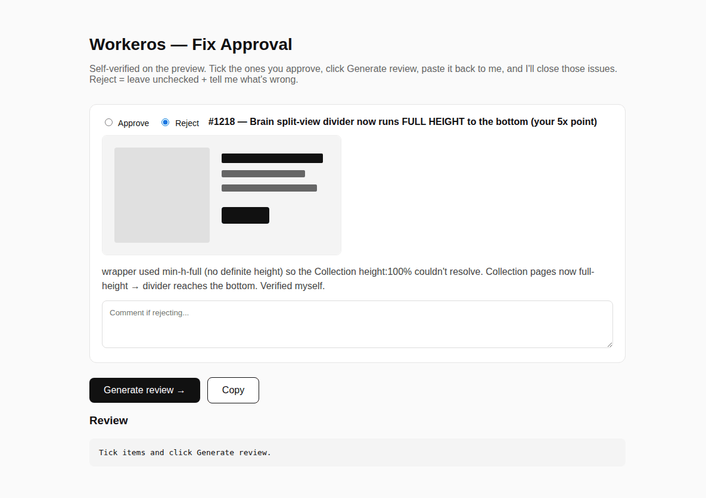

# ApprovalUI

A tiny open-source loop for reviewing UI fixes inside terminal-based AI agents.

Terminal agents are great for code. They are bad at UI feedback, because UI feedback needs eyes, not paragraphs.

ApprovalUI renders a clickable HTML approval page from a simple JSON spec. You open it in a browser, tick approve or reject per item, generate a review, and paste it back into the agent.



## Quick links

- [Why ApprovalUI?](architecture.md)
- [Architecture and data flow](architecture.md)
- [Advanced usage](advanced.md)
- [Troubleshooting](troubleshooting.md)
- [Claude Code example](examples/claude.md)
- [Codex example](examples/codex.md)
- [Kimi example](examples/kimi.md)
- [GitHub repository](https://github.com/floomhq/approvalui)
- [PyPI package](https://pypi.org/project/approvalui/)

## Install

```bash
pip install approvalui
```

## Quick start

```bash
approvalui example/fixes.json example/approval.html
open example/approval.html
```

## License

MIT
